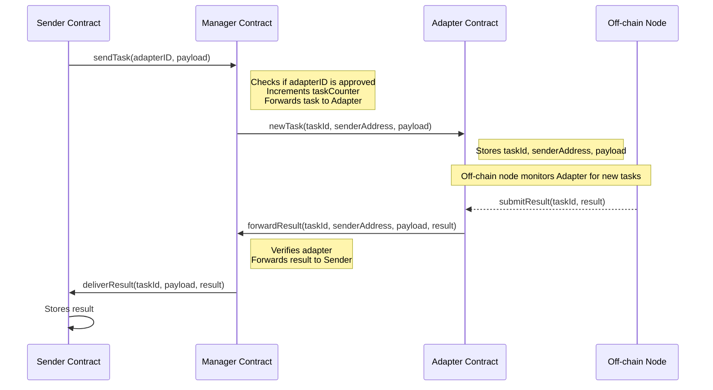
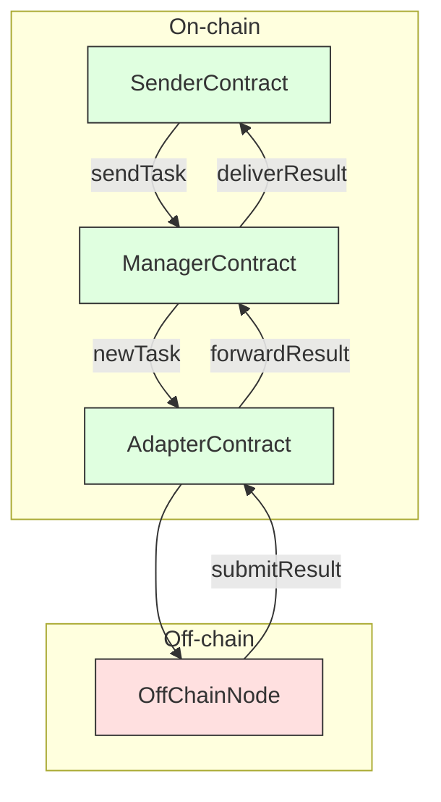

# **TON Oracle Network**

## **Overview**

This project involves a system of smart contracts on the TON blockchain designed to facilitate asynchronous task processing with off-chain computation. The key components are:

-   **Manager Contract**: Manages a list of adapters and coordinates task distribution.
-   **Adapter Contract**: Receives tasks from the Manager, stores them, and interfaces with off-chain nodes for processing.
-   **Sender Contract**: Sends tasks to the Manager and receives results.
-   **Off-chain Node**: Monitors the Adapter for new tasks, processes them, and submits results back to the Adapter.

---

## **Contracts and Their Roles**

### **Manager Contract**

-   **Responsibilities:**
    -   Stores a list of approved Adapters (addresses tied to specific IDs).
    -   Receives tasks from Sender contracts.
    -   Forwards tasks to the appropriate Adapter.
    -   Receives results from Adapters and forwards them to the Sender contracts.

### **Adapter Contract**

-   **Responsibilities:**
    -   Accepts tasks only from the Manager contract.
    -   Stores the task payload and the Sender's address.
    -   Notifies off-chain nodes of new tasks.

### **Sender Contract**

-   **Responsibilities:**
    -   Sends tasks with payloads to the Manager, specifying which Adapter to use.
    -   Receives results from the Manager.
    -   Validates that results come from the Manager contract.
    -   Stores the results for retrieval.

### **Off-chain Node**

-   **Responsibilities:**
    -   Monitors the Adapter for new tasks.
    -   Processes tasks using external APIs or computations.
    -   Sends task results back to the Adapter.

---

## **Interaction Flow**

### **Step-by-Step Process**

1. **Sender Contract Sends Task to Manager**

    - The Sender contract sends a message to the Manager contract with:
        - **Payload**: The data required for the task (e.g., API parameters).
        - **Adapter ID**: The identifier of the Adapter intended to process the task.

2. **Manager Forwards Task to Adapter**

    - The Manager contract:
        - Verifies that the Adapter ID is in its list of approved Adapters.
        - Increments a global task counter to generate a unique `taskId`.
        - Sends a message to the Adapter contract with:
            - **Task ID**: Unique identifier for the task.
            - **Sender's Address**: Address of the Sender contract.
            - **Payload**: The task data.

3. **Adapter Stores Task and Notifies Off-chain Node**

    - The Adapter contract:
        - Accepts the task only if it comes from the Manager contract.
        - Stores the `taskId`, `payload`, and `senderAddress`.
        - The off-chain node detects the new task.

4. **Off-chain Node Processes Task**

    - The off-chain node:
        - Monitors the Adapter contract for new tasks.
        - Retrieves the task details using the `taskId`.
        - Performs the necessary computations or API calls based on the `payload`.
        - Generates a `result` for the task.

5. **Off-chain Node Sends Result to Adapter**

    - The off-chain node sends the `result` back to the Adapter contract, specifying the `taskId`.

6. **Adapter Forwards Result to Manager**

    - The Adapter contract:
        - Accepts the result submission only if it matches an existing `taskId`.
        - Forwards the `result`, along with the original `payload` and `senderAddress`, to the Manager contract.

7. **Manager Forwards Result to Sender**

    - The Manager contract:
        - Verifies that the result comes from an approved Adapter.
        - Sends the `payload` and `result` to the original Sender contract.

8. **Sender Contract Stores Result**

    - The Sender contract:
        - Accepts the result only if it comes from the Manager contract.
        - Stores the `result` for future retrieval or processing.

---

## **Sequence Diagram**



---

## **Components Interaction Diagram**



-   **Green Boxes**: On-chain components and interactions.
-   **Red Boxes**: Off-chain components and interactions.

---

## **Detailed Interaction Steps**

### **1. Sender Contract Sends Task**

-   **Function Called**: `sendTask(adapterID, payload)`
-   **Action**: Sends an internal message to the Manager contract with the specified Adapter ID and payload.
-   **On-chain Interaction**: Yes.

### **2. Manager Forwards Task to Adapter**

-   **Function Called**: `receiveRequest(adapterAddress, payload)`
-   **Action**:
    -   Verifies the Adapter is in its approved list.
    -   Increments `taskCounter` to generate `taskId`.
    -   Sends `newTask(taskId, senderAddress, payload)` to the Adapter.
-   **On-chain Interaction**: Yes.

### **3. Adapter Stores Task**

-   **Function Called**: `newTask(taskId, senderAddress, payload)`
-   **Action**:
    -   Verifies the message is from the Manager.
    -   Stores `taskId`, `senderAddress`, and `payload`.
-   **On-chain Interaction**: Yes.

### **4. Off-chain Node Processes Task**

-   **Action**:
    -   Monitors the Adapter for new tasks.
    -   Retrieves the task using `taskId`.
    -   Processes the task based on `payload`.
    -   Generates a `result`.
-   **Off-chain Interaction**: Yes.

### **5. Off-chain Node Sends Result to Adapter**

-   **Function Called**: `submitResult(taskId, result)`
-   **Action**:
    -   Sends an external message to the Adapter with the `taskId` and `result`.
-   **On-chain Interaction**: Yes (from off-chain to on-chain).

### **6. Adapter Forwards Result to Manager**

-   **Function Called**: `submitResult(taskId, result)`
-   **Action**:
    -   Verifies `taskId` exists and is pending.
    -   Updates task status to completed.
    -   Sends `forwardResult(taskId, senderAddress, payload, result)` to the Manager.
-   **On-chain Interaction**: Yes.

### **7. Manager Forwards Result to Sender**

-   **Function Called**: `deliverResult(taskId, payload, result)`
-   **Action**:
    -   Verifies the message is from an approved Adapter.
    -   Sends the `payload` and `result` to the Sender contract.
-   **On-chain Interaction**: Yes.

### **8. Sender Contract Stores Result**

-   **Function Called**: `receiveResult(taskId, payload, result)`
-   **Action**:
    -   Verifies the message is from the Manager contract.
    -   Stores the `result`.
-   **On-chain Interaction**: Yes.

---

## **Contract Code Overview**

### **Manager Contract (FunC)**

-   **Global Variables**:

    -   `task_counter`: Keeps track of the number of tasks.
    -   `adapters_dict`: Dictionary of approved Adapter addresses.
    -   `owner_address`: Address of the contract owner.

-   **Key Functions**:
    -   `add_adapter(adapter_address)`: Adds an Adapter to the approved list.
    -   `remove_adapter(adapter_address)`: Removes an Adapter from the approved list.
    -   `receive_request(adapter_address, payload)`: Receives tasks from Sender contracts and forwards them to Adapters.
    -   `recv_internal()`: Handles internal messages.

### **Adapter Contract (FunC)**

-   **Global Variables**:

    -   `tasks_dict`: Stores tasks with their statuses.
    -   `manager_address`: Address of the Manager contract.

-   **Key Functions**:
    -   `new_task(task_id, requester_address, payload)`: Stores new tasks from the Manager.
    -   `submit_result(task_id, result)`: Receives results from off-chain nodes and forwards them to the Manager.
    -   `recv_internal()`: Handles internal messages.
    -   `recv_external()`: Handles external messages from off-chain nodes.

---

## **Setup and Deployment**

1. **Install Dependencies**:

    ```bash
    npm install
    ```

2. **Compile Contracts**:

    Use the appropriate tools to compile the FunC contracts into deployable code.

3. **Deploy Contracts**:

    Deploy the Manager and Adapter contracts to the TON blockchain.

4. **Deploy Sender Contracts**:

    Deploy Sender contracts that will interact with the Manager.

---

## **Usage**

-   **Adding an Adapter**:

    The contract owner can add an Adapter by calling `add_adapter(adapter_address)` on the Manager contract.

-   **Sending a Task**:

    A Sender contract sends a task to the Manager by calling `sendTask(adapterID, payload)`.

-   **Processing and Result Retrieval**:

    After the off-chain node processes the task, the result flows back through the Adapter and Manager to the Sender contract, which stores it for retrieval.

---

## **Considerations**

-   **Asynchronous Processing**:

    Due to the nature of blockchain transactions, the system operates asynchronously. The Sender contract cannot immediately receive the result after sending the task.

-   **Security**:

    -   **Verification of Senders**: Contracts verify the source of messages to prevent unauthorized interactions.
    -   **Adapters Management**: Only the contract owner can add or remove Adapters in the Manager contract.

-   **Off-chain Nodes**:

    -   Off-chain nodes must securely interact with the Adapter contract.
    -   They should monitor the Adapter for new tasks and handle network latency or potential failures.

---

## **Conclusion**

This project demonstrates a system where smart contracts on the TON blockchain can interact with off-chain systems to perform complex computations or integrations, such as API calls. By leveraging the asynchronous nature of blockchain transactions and secure contract interactions, it ensures reliable task processing and result delivery between on-chain and off-chain components.

---

## **License**

This project is licensed under the MIT License.

---

## **Acknowledgments**

-   [TON Blockchain](https://ton.org/)
-   [FunC Language Documentation](https://ton.org/docs/#/func/overview)
-   [TON Community](https://t.me/ton_en)

---

**Note**: Replace placeholders like function names and opcodes with actual values from your contracts when implementing.
